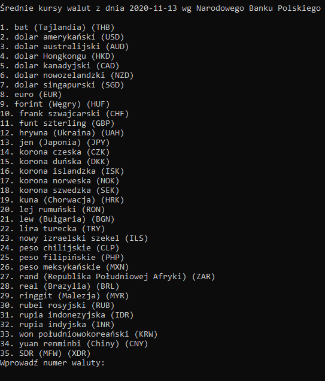
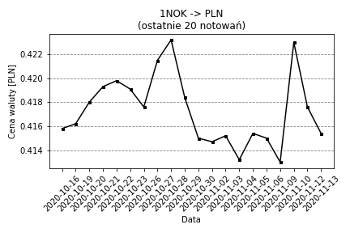

# Currency Converter
35 currencies in one place

## General info
My Currency Converter is console based application for currency conversion. It downloads and uses data from NBP's official site.
It also uses NBP's archives to draw a plot with last 20 rates of selected currency and save it in 'figure.png'.

## How it works
First, application downloads exchange rates of 35 currencies according to NBP. Then user have to choose currency by typing number of selected currency.
Next user have to decide what he wants to do. First option is currency conversion. In this case app converts PLN to currency of user's choice or vice versa.
Second option displays last 20 prices of selected currency.  

## Screenshots

## Technologies
* Python 3.7
Libraries:
* BeautifulSoup
* Requests
* urllib
* XLRD
* Matplotlib
